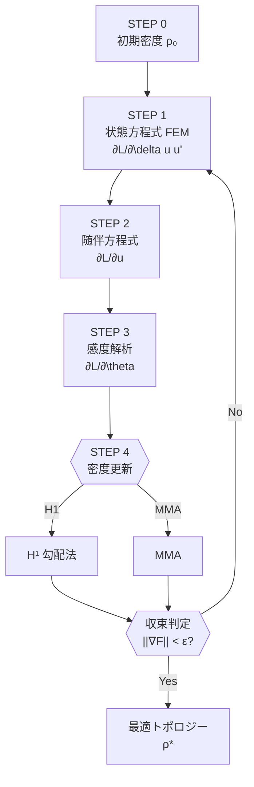

# Topology Optimization via Lagrangian Differentiation　静解析版 

## 目次
1. はじめに  
2. 問題設定  
3. アルゴリズムの全体像  
4. ステップバイステップ解説  

---

## 1. はじめに
トポロジー最適化は**材料分布を最適化し，目標性能を最大化（または最小化）**する設計手法です。  
この README では **ラグランジアンの微分**を用いた一般的フレームワークをまとめます。  

> **キーワード**: Lagrangian, adjoint method, sensitivity analysis, SIMP, MMA, H¹‐gradient

---

## 2. 問題設定（静解析）
- **設計変数** : 体積密度場 $\rho(\mathbf{\theta})$  
- **状態変数** : 変位場 $u(\mathbf{x})$  
- **目的関数** : $F\bigl(u,\theta\bigr)$（例：特定点の変位，構造全体のコンプライアンスなど）  
- **残差（弱形式）** : $R\bigl(u,\theta, \delta u\bigr)=0$  
- **ラグランジアン** :  $\mathcal{L}(u,\theta,\delta u)=F(u,\theta)-R(u,\rho, \delta u)$

---

## 3. アルゴリズムの全体像
1. **状態方程式**（構造式）を解く  
2. **随伴方程式**を解く  
3. **感度（勾配）**を評価  
4. **密度場の更新**（MMA⁄H¹勾配法など）  
5. 収束判定 → 収束していなければ 1. へ



---

## 4. ステップバイステップ解説
### Step 1 : 状態方程式の求解  
$\displaystyle \frac{\partial \mathcal{L}}{\partial v}\delta v'=0  \; \Longrightarrow \; R(u,\rho;v)=0 \quad\forall v$  
→ FEM により変位 $u$ を得る。

---

### Step 2 : 随伴方程式の求解  
$\displaystyle \frac{\partial \mathcal{L}}{\partial u}(u,\rho,\lambda)=0  \; \Longrightarrow \; \text{adjoint equation for } \lambda$  
→ 同じメッシュ／剛性行列を用いて逆問題を解く。

---

### Step 3 : 感度解析  
$\displaystyle g(\mathbf{x})=\frac{\partial \mathcal{L}}{\partial \rho}(u,\rho,\lambda)$  
→ 体積密度の局所感度。  

---

### Step 4 : 密度更新  
- **H¹‐gradient**  
  \[
  \rho^{k+1} = \rho^{k} - \alpha \, \Delta^{-1} g
  \]
- **MMA**  
  ```text
  minimize   MMA sub-problem
  subject to volume constraint
