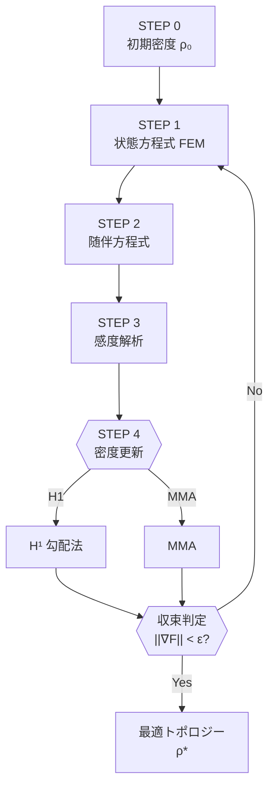

# Topology Optimization via Lagrangian Differentiation　静解析版 

cloneやzipとしてこのレポジトリをダウンロードして以下で動かす．

```
cd topology_sample
python static/nonlinear.py
```

動かしながら以下の資料を読みながらコードと照らし合わせてください．
動かなかったら何かアップし忘れていると思うのですぐ言ってください．

## 目次
1. はじめに  
2. 問題設定  
3. アルゴリズムの全体像  
4. ステップバイステップ解説  

---

## 1. はじめに
トポロジー最適化は**材料分布を最適化し，目標性能を最大化（または最小化）** する設計手法です．  
この README では **ラグランジアンの微分**を用いた一般的フレームワークをまとめます．
nonlinear.pyを例として式を表す．以下がnonlinear.pyで扱っている問題の設計領域


> **キーワード**: Lagrangian, adjoint method, sensitivity analysis, SIMP, MMA, H¹‐gradient

---

## 2. 問題設定（静解析）
- **設計変数** : 体積密度場 $\rho(\mathbf{\theta}) \in [0,1] \qquad$    例： $\rho(\mathbf{\theta}) = 0.5*(\text{tanh}(\mathbf{\theta})+1)$
- **状態変数** : 変位場 $u$  
- **最小化したい目的関数** : $F (u,\theta )$（例：特定点の変位，構造全体のコンプライアンスなど） $F(u, \theta) = \int_{\Gamma_{ext}} f^{\text{ext}} \cdot u dx$
- **残差（弱形式）** : $R (u,\theta, \delta u )=0 \qquad$ 例： $R(u,\theta;\delta u) = \int_{\Omega} \rho^{p}\boldsymbol{P}(u) : \delta \boldsymbol{F}(\delta u) \mathrm{d}\Omega - \int_{\Gamma_{\text{ext}}} \mathbf{t} \cdot \delta u \mathrm{d}\Gamma_{\text{ext}} = 0 \quad \forall\,\delta u$ 
- **ラグランジアン** :  $\mathcal{L}(u,\theta,\delta u)=F(u,\theta)-R(u,\rho, \delta u)$
- **制約条件** : 体積制約が多い $\int_{\Omega} \rho(\theta) dx - V_{\text{lim}} \leqq 0$

---

## 3. アルゴリズムの全体像
1. **状態方程式**（構造式）を解く  
2. **随伴方程式**を解く  
3. **感度（勾配）** を評価  
4. **密度場の更新**（MMA⁄H¹勾配法などを用いて制約条件が満たされるように更新する）  
6. 収束判定 → 収束していなければ 1. へ

---

## 4. ステップバイステップ解説
### Step 1 : 状態方程式の求解  
方向微分をとるのにガトー微分する．ガトー微分ではある関数で微分してテスト関数をかける．

$\displaystyle \frac{\partial \mathcal{L}}{\partial \delta u}\delta u'=0  \quad\forall \delta u'$  

ここで，u'はuに対するテスト関数である．

→ 上の式を解くことで変位 $u$ を得る．実際に微分した式を計算してみてください．

上の式はFenicsではfe.derivative(L, $\delta u$ , $\delta u'$)　と書く．

---

### Step 2 : 随伴方程式の求解  
$\displaystyle \frac{\partial \mathcal{L}}{\partial u} u'=0 $  

→ 上の式を解くことで $\delta u$ を得る．

---

### Step 3 : 感度解析  
$\displaystyle g(\mathbf{\theta})=\frac{\partial \mathcal{L}}{\partial \theta} \theta'$  

→ を計算することで感度が得られる． 

---

### Step 4 : 密度更新  
- **H¹‐gradient**
得られた感度を体積制約を満たしている方向に変換
  

  
- **MMA**  
こっちの方が収束が早く，よくつかわれているので現在移行しようとしてます．

## アルゴリズムのフローチャート ##



# 感度解析検証ガイド

> **対象範囲**
> 本 README は **解析的／随伴感度** と **有限差分（中央差分）による「差分感度」** を比較して感度計算が正しいか確認する手順を解説します。。

---

## 1 なぜ感度を検証するのか

* **正確性** — 勾配が誤っていると最適化が収束しない、または劣った解に終わる。
* **デバッグ** — 大きな誤差は符号ミスや正規化漏れなどのバグ指標。
* **信頼性** — 論文やレポートで感度検証図を要求されることが多い。

> **目安**：解析感度と FD 感度の相対誤差が $<10^{-3}$ を超えると要注意。

---

## 2 記号

| 記号                                | 意味                               |      
| --------------------------------- | -------------------------------- | 
| $F(\mathbf{x})$                   | 設計ベクトル $\mathbf{x}$ における目的関数／制約値 |
| $s_i = \partial F / \partial x_i$ | 解析（随伴）感度                         |      
| $\mathbf{e}_i$                    | 第 $i$ 成分方向の単位ベクトル                |      
| $h$                               | 有限差分ステップ（通常 $10^{-3}$〜 $10^{-1}$ ) | 
| $s_i^{\mathrm{FD}}$               | FD による感度推定値                      |      

---

## 3 中央差分式

2 次精度で誤差 $\mathcal O(h^2)$：

$$
\boxed{\;s_i^{\mathrm{FD}} 
  = \dfrac{F(\mathbf{x}+h\mathbf{e}_i) - F(\mathbf{x}-h\mathbf{e}_i)}{2h}\;}
$$

---

## 4 検証手順（ステップバイステップ）

1. **基準設計** $\mathbf{x}_0$ を決める（通常は現在反復点）。
2. **解析感度** $s_i$ を全設計変数で計算。
3. **各変数ごとに**

   1. 摂動： $\mathbf{x}_\pm = \mathbf{x}_0 \pm h\mathbf{e}_i$
   2. 目的／制約を再計算： $F_+, F_-$
   3. 中央差分で $s_i^{\mathrm{FD}}$ を算出。
4. **比較**
5. **可視化**
   


