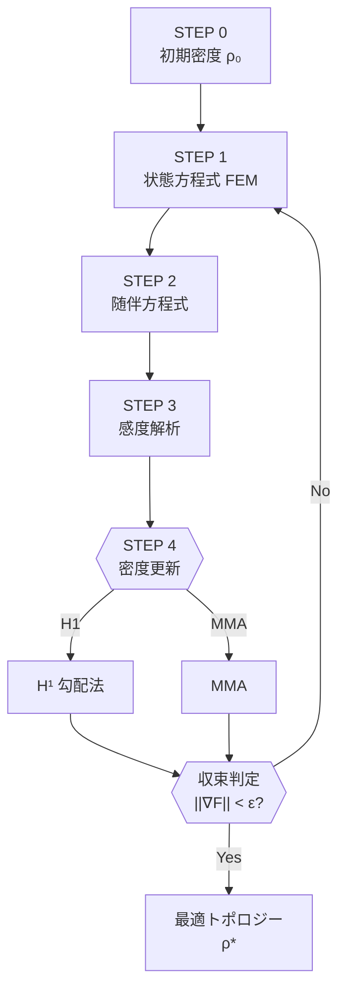

# Topology Optimization via Lagrangian Differentiation　静解析版 

## 目次
1. はじめに  
2. 問題設定  
3. アルゴリズムの全体像  
4. ステップバイステップ解説  

---

## 1. はじめに
トポロジー最適化は**材料分布を最適化し，目標性能を最大化（または最小化）** する設計手法です．  
この README では **ラグランジアンの微分**を用いた一般的フレームワークをまとめます．
nonlinear.pyを例として式を表す．以下がnonlinear.pyで扱っている問題の設計領域


> **キーワード**: Lagrangian, adjoint method, sensitivity analysis, SIMP, MMA, H¹‐gradient

---

## 2. 問題設定（静解析）
- **設計変数** : 体積密度場 $\rho(\mathbf{\theta}) \in [0,1] \qquad$    例： $\rho(\mathbf{\theta}) = 0.5*(\text{tanh}(\mathbf{\theta})+1)$
- **状態変数** : 変位場 $u$  
- **最小化したい目的関数** : $F\bigl(u,\theta\bigr)$（例：特定点の変位，構造全体のコンプライアンスなど） $F(u, \theta) = \int_{\Gamma_{ext}} f^{\text{ext}} \cdot u dx$
- **残差（弱形式）** : $R\bigl(u,\theta, \delta u\bigr)=0 \qquad$ 例： $R(u,\theta;\delta u) = \int_{\Omega} \rho^{p}\boldsymbol{P}(u) : \delta \boldsymbol{F}(\delta u) \mathrm{d}\Omega - \int_{\Gamma_{\text{ext}}} \mathbf{t} \cdot \delta u \mathrm{d}\Gamma_{\text{ext}} = 0 \quad \forall\,\delta u$ 
- **ラグランジアン** :  $\mathcal{L}(u,\theta,\delta u)=F(u,\theta)-R(u,\rho, \delta u)$
- **制約条件** : 体積制約が多い $\int_{\Omega} \rho(\theta) dx - V_{\text{lim}} \leqq 0$

---

## 3. アルゴリズムの全体像
1. **状態方程式**（構造式）を解く  
2. **随伴方程式**を解く  
3. **感度（勾配）** を評価  
4. **密度場の更新**（MMA⁄H¹勾配法などを用いて制約合憲が満たされるように更新する）  
6. 収束判定 → 収束していなければ 1. へ

---

## 4. ステップバイステップ解説
### Step 1 : 状態方程式の求解  
方向微分をとるのにガトー微分する．

$\displaystyle \frac{\partial \mathcal{L}}{\partial \delta u}\delta u'=0  \quad\forall \delta u'$  

ここで，u'はuに対するテスト関数である．

→ 上の式を解くことで変位 $u$ を得る．

上の式はFenicsではfe.derivative(L, $\delta u$ , $\delta u'$)　と書く．

---

### Step 2 : 随伴方程式の求解  
$\displaystyle \frac{\partial \mathcal{L}}{\partial u} u'=0 $  

→ 上の式を解くことで$\delta u$を得る．

---

### Step 3 : 感度解析  
$\displaystyle g(\mathbf{\theta})=\frac{\partial \mathcal{L}}{\partial \theta} \theta'$  

→ を計算することで感度が得られる． 

---

### Step 4 : 密度更新  
- **H¹‐gradient**
得られた感度を体積制約を満たしている方向に変換
  

  
- **MMA**  
  ```text
  minimize   MMA sub-problem
  subject to volume constraint



